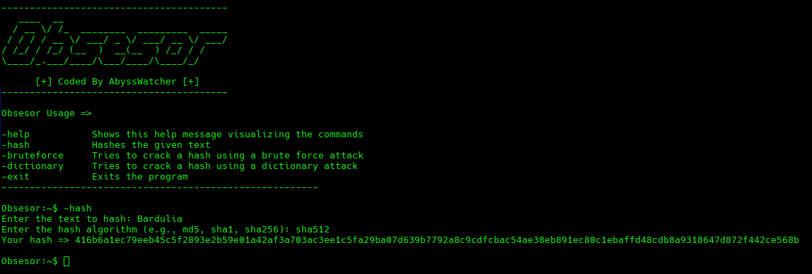

# Obsesor

Obsesor is a command-line interface (CLI) tool developed for cybersecurity, focused on hash generation and cracking. It allows brute force and dictionary attacks to decrypt hashes using various hashing algorithms.

<b>Features</b>
- Hash Generation: Generates text hashes using algorithms like MD5, SHA1, SHA256, among others.
- Brute Force Attack: Attempts to decrypt a hash by trying all possible character combinations up to a specified maximum length.
- Dictionary Attack: Attempts to decrypt a hash using a dictionary file of words.
- User-Friendly Interface: Provides an interactive interface with clear options and progress bars to visualize the progress of attacks.

## Hashing

A hash is a fixed-length string or number generated from input data of any length. Hashes are used in various applications, including data integrity verification and password storage. Common hashing algorithms include MD5, SHA1, and SHA256.

<b>Important Considerations</b>
Cracking a hash is a challenging task that requires significant time and computational resources. The difficulty of cracking a hash increases exponentially with the length and complexity of the input data. Here are some key points to keep in mind:

- Time-Consuming: Brute force attacks, in particular, can take an extremely long time to complete, especially for hashes generated from longer strings.
- Resource-Intensive: Both brute force and dictionary attacks can heavily tax your computer's CPU and memory.
- Exponential Growth: The time required to crack a hash increases exponentially with the length of the input data. For example, a hash generated from a 6 character string will take significantly longer to crack than one generated from a 5-character string.

With my personal laptop I have get a media of 1.500.000 comprobations per second, using a brute force attack I have cracked a hash with 5 characters in 2 hours.

## Disclaimer
Obsesor is intended for educational purposes and legitimate cybersecurity testing only. The developer does not condone or support any illegal activity, including unauthorized access to systems or data. Users are solely responsible for ensuring that their use of this tool complies with all applicable laws and regulations.

By using Obsesor, you agree to use it responsibly and ethically. The developer assumes no liability for any misuse or damage caused by the use of this tool.

## Installation (Arch Linux example)

To install Obsesor you only need to clone this repository and run the installation script. Obsesor offers three different scripts depending on what distribution you are using:

    Arch Linux (using pacman)
    Fedora (using dnf)
    Debian (using apt)

First clone the repository:

    git clone https://github.com/UnknownArtistt/Obsesor

Give execution permissions to the script:

    chmod +x obsesor_arch.sh

Run the script:

    ./obsesor_arch.sh
